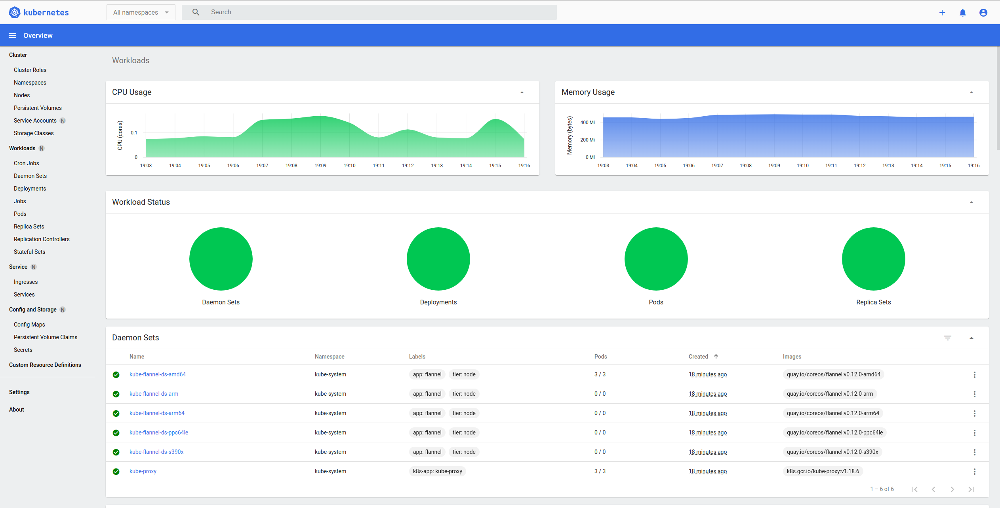

# kubernetes-localhost
**Due to be updated, it works, but some approaches need to be reworked.**
[](https://asciinema.org/a/352272?autoplay=1&speed=5)
Deploys Kubernetes with loadbalancer, dashboard, persistent storage, and monitoring
on local machine using Vagrant.

By default you get 1 master, 2 working nodes, NFS server, loadbalancer,
monitoring, image registry, and deployed dashboard.

Version of deployed Kubernetes cluster is 1.20.1, version of Ubuntu VirtualBox
image is 18.04.

## Dashboard
Dashboard is available via port 30000 on worker nodes.
If you didn't change network ip range or number of worker nodes in Vagrantfile,
dashboard will be available on both:
- https://192.168.100.101:30000
- https://192.168.100.102:30000

**Note:**
In order to access dashboard via Chromium based browsers, you'll have to bypass
invalid error certificate error on above mentioned URLs. In order to do that,
just type `thisisunsafe` while on dashboard page. You don't need any input
field, just typing it while on that page will do the trick.



## Storage
Persistent volume `pv-nfs` and 5GB persistent volume claim `pvc-nfs` are provided automatically.
For examples on how to use/create your own pv/pvc, check `/storage` directory.

## Load-balancer
For bare-metal loadbalancing purposes [MetalLB](https://metallb.universe.tf/) is used.
For deployment manifests check `/lb` directory.

## Monitoring
Prometheus operator is installed, if you wish to consume it, check example in
`monitoring/prometheus-example.yaml`. Full blown setup with node-exporter,
kube-state-metrics, alertmanager, and Grafana is a bit too resource expensive
for what this project aims to achieve.

## Image registry
Docker Registry v2 is used for image registry inside of the cluster.
If you wish to use it, you can access it on port 30001. Simple web ui is hosted
on port 30002 (check endpoints in `docker-registry` namespace).
You will have to add [insecure registry entry](https://docs.docker.com/registry/insecure/)
to your docker daemon.

**Note:**
In case web ui is not showing repositories properly, check `REGISTRY_URL` in its
deployment, and make sure it has proper value.

## Requirements
* [Vagrant](https://www.vagrantup.com/)
* [VirtualBox](https://www.virtualbox.org/)

**Note**:
Vagrantfile uses ansible_local module, which means you don't need Ansible
installed on your workstation. However, if you already have it installed,
and prefer to use that instead of letting Vagrant install Ansible on each
node separately, change `*vm.provision` from `ansible_local` to `ansible` in
Vagrantfile.

Another option is having dedicated "controller" node, which can be used as
Ansible host. You can learn more by visiting this [link](https://www.vagrantup.com/docs/provisioning/ansible_local.html#ansible-parallel-execution-from-a-guest).

## How-To Manual

#### New setup:
* Clone this repository
* Run `vagrant up`

#### Poweroff machines:
* Run `vagrant halt`

#### Checking nodes status:
* Run `vagrant status`

#### Accessing master/worker nodes:
* While in project directory, type:
```shell
vagrant ssh $NAME_OF_THE_NODE
```
Example:
```shell
vagrant ssh k8s-master
```

#### Using kubectl from local workstation without SSH-ing via Vagrant
* Create dedicated config directory in local `.kube` directory
```bash
# Create directory in which you're going to store Kubernetes config
mkdir -p ~/.kube/kubernetes-localhost
# Copy file from Kubernetes master
scp -i ~/.vagrant.d/insecure_private_key vagrant@192.168.100.100:~/.kube/config ~/.kube/kubernetes-localhost
```
Note: In case you redeploy cluster, you'll have to remove previous entry from `.ssh/known_hosts` or you'll
get `WARNING: REMOTE HOST IDENTIFICATION HAS CHANGED!` warning, you can use
this command for example:
```bash
sed -i "/192.168.100.100/d" ~/.ssh/known_hosts
```
* You can now access Kubernetes cluster without sshing into Vagrant box:

`kubectl --kubeconfig=/home/$USER/.kube/kubernetes-localhost get pods --all-namespaces`

Optional:
Create alias in configuration file of your shell, for example:
```bash
# Open rc file
vim ~/.zshrc
# Insert alias
alias kubectl_local='kubectl --kubeconfig=/home/$USER/.kube/kubernetes-localhost'
# Save and exit Vim (can't help you there), and reload config
source ~/.zshrc
# Test
kubectl_local get pods --all-namespaces
```

#### Obtaining token for Dashboard access
* Check for secret name
```bash
kubectl get secrets -n kube-system | grep 'dashboard'
# Example:
kubectl describe secret/dashboard-access-token-mb7fw -n kube-system
```
* Navigate to one of above mentioned URLs and paste it in there

#### Delete setup:
* Run `vagrant destroy -f`
* Remove repository

